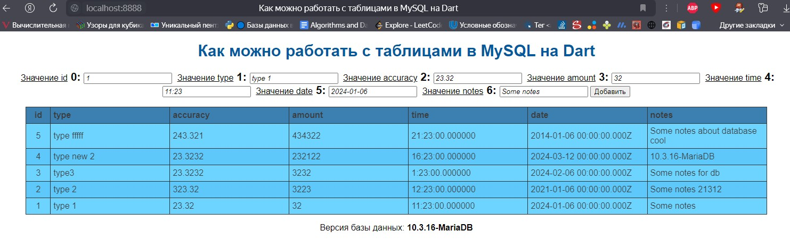

# Практика языка Dart
Как можно работать с таблицами в MySQL на Dart

## Вид

## Запуск
Пример гарантированно работает при установке модулей dart_frog_cli и mysql. Для этого, после установки Dart нужно выполнить команды:
1) dart pub global activate dart_frog_cli
2) dart pub install mysql
3) dart .\srv.dart
